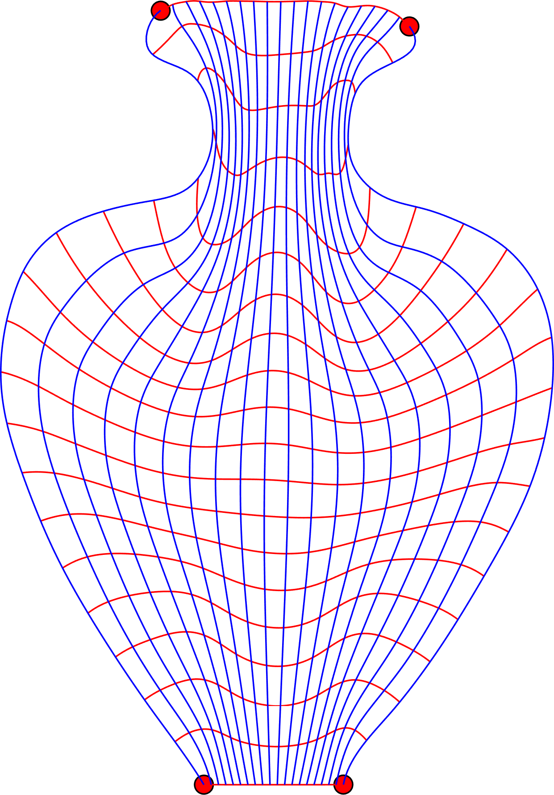
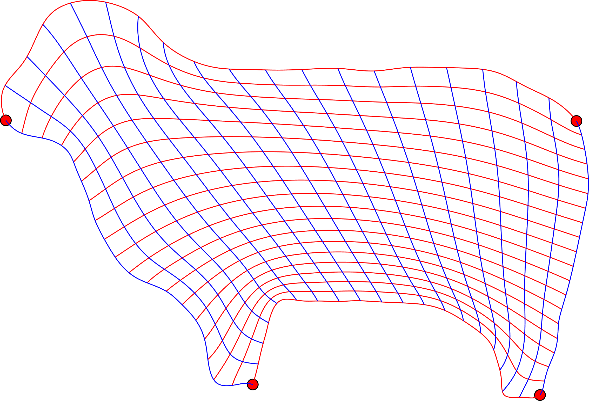
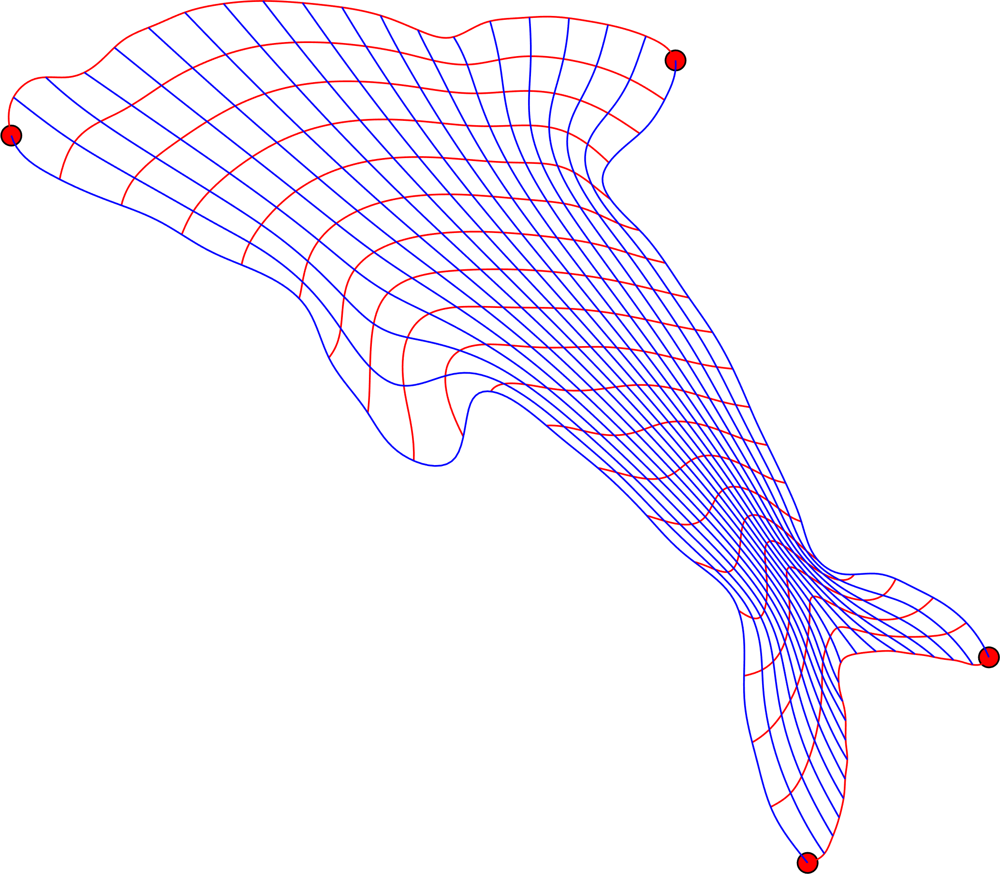

# Boundary Correspondence of Planar Domains for Isogeometric Analysis Based on Optimal Mass Transport[1]

  

An automatic approach to compute a correspondence between the boundaries of a unit square and a planar domain based on optimal mass transport.  The result serves as the input of subsequent domain parameterization [2].

Tested on Windows 10 (matlab 2018b, MinGW) and Ubuntu 18.04 (matlab 2018b, gcc).

### Dependences

matlab toolboxs: 

- curve fitting
- mapping
- optimization (for parametrization [2])

`mex` files are provided on linux and Windows platform. If you want to compile the `mex` file yourself,  [stanmath](https://github.com/stan-dev/math) package is needed.

### References

[1]https://www.researchgate.net/publication/332606953_Boundary_Correspondence_of_Planar_Domains_for_Isogeometric_Analysis_Based_on_Optimal_Mass_Transport
[2] M. Pan, F. Chen, W. Tong, Low-rank parameterization of planar domains for isogeometric analysis, Computer Aided Geometric Design 63 (2018) 1–16.